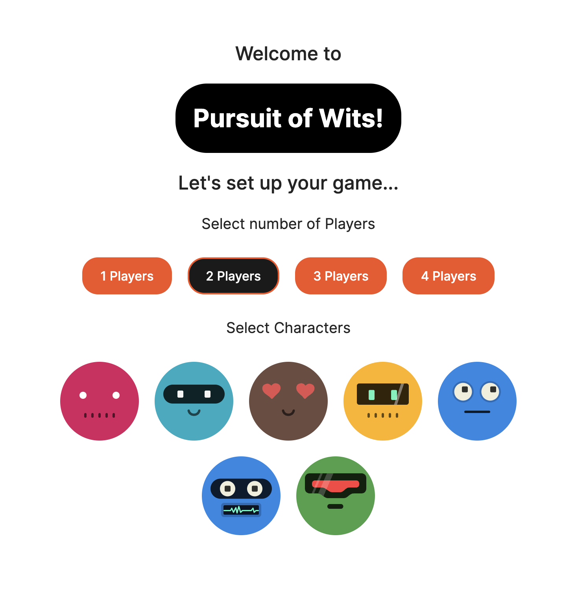

# Pursuit of Wits 🏆

## Description

Pursuit of Wits is a turn-based strategy game built with Vite and React where players can test their knowledge by answering trivia questions for a chance to roll the dice. The first player to reach the end of the board wins!

## Usage

The deployed site can be found at [here](https://pursuit-of-wits.netlify.app/).

## License

This repo is liscenced under the [MIT](https://choosealicense.com/licenses/mit/) license.
